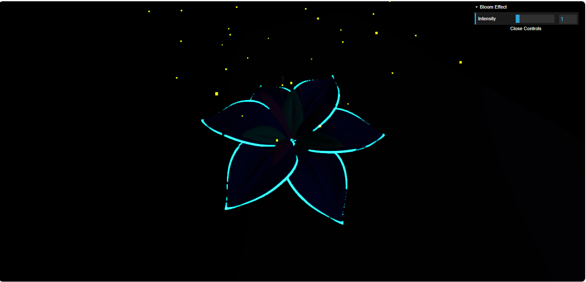
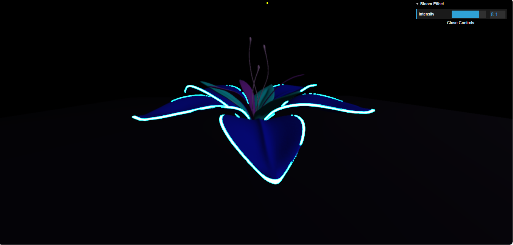
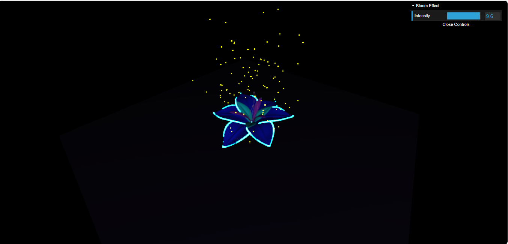

# Lab 3 Shaders y Materiales | CI5321

## Description 
This project explores bloom effects on emissive materials within dynamic 3D environments. The goal is to demonstrate how bloom enhances the lighting and realism of light-emitting objects, creating vibrant visuals.

## Team Members
- **Jennifer Gámez** - Carnet: 16-10396
- **Amaranta Villegas** - Carnet: 16-11247

## Development environment

This project was developed using the following tech stack:

- [Visual Studio Code](https://code.visualstudio.com/)
- [Node.js v20.13.1](https://nodejs.org/en)
- [Vite](https://vite.dev/)
- [Vite Plugin GLSL](https://www.npmjs.com/package/vite-plugin-glsl)
- [Three.js](https://threejs.org/)

## How to run this project

1. Download and copy this project
    ``git clone https://github.com/JenniferGamez/proyecto_03_1610396_1611247.git ``
2. Install a compatible Node.js version (I guess any v20.10+ should suffice)
3. Run `npm install` to install the dependencies
4. Run `npm run dev` to run the Three.js project, usually on port 5173
5. perfect

### Important Links
- [GitHub Repository](https://github.com/JenniferGamez/proyecto_03_1610396_1611247/) 
- [Video Link](https://drive.google.com/file/d/1IS3Wn_8sH6EsZyxtzVhqPeNVtf9zVXVT/view?usp=sharing)

## ScreenShoots

Flor que da fulgor con tu brillo fiel mueve el tiempo atrás Volviendo a lo que fue!!!!

